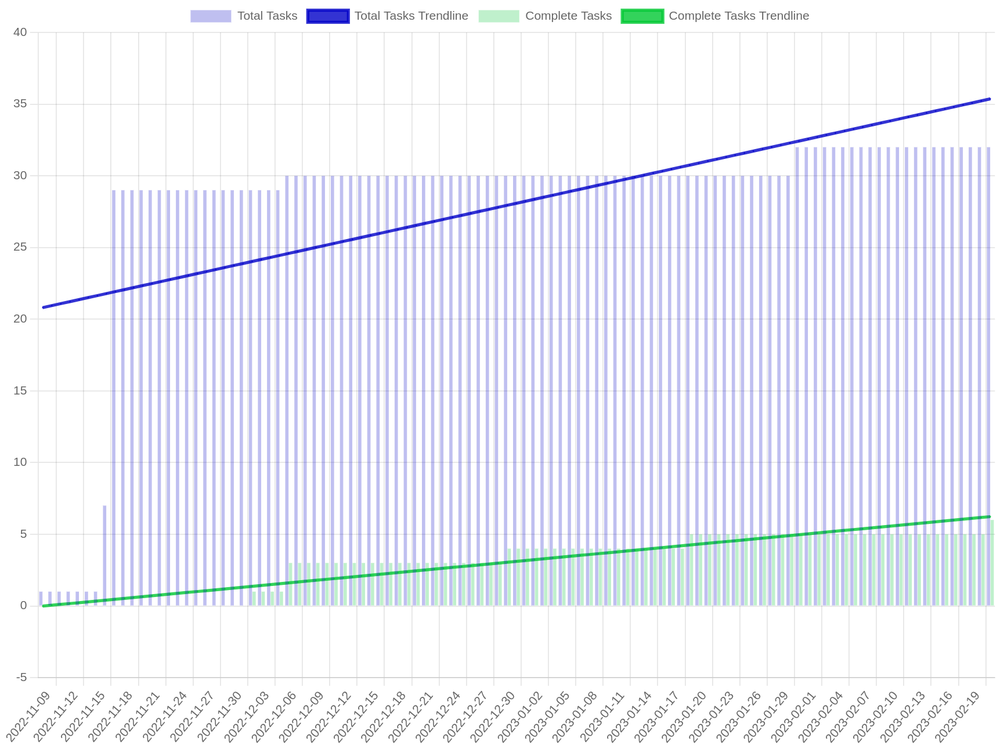

Projections, not Estimates
--------------------------

What is an alternative to estimation? Projections!

A projection differs from an estimate in that it bases the completion date on available data. Take a sufficiently large story and break it down into tasks. At this point, we have no information about work done on the story, so there is no projection. Instead of estimating, start working on the story. Over time, tasks in the story will be completed, and new tasks will be added. This change over time gives us two regressions, one for the rate at which the story grows, and the rate at which the story is completed. We want to know when the overall story is completed, we can project these two regressions into the future and see when they intersect.

There are three possibilities here:

1. **They never intersect.** It just so happens we've added new tasks at the same rate as we have completed tasks. This will resolve by tomorrow, probably. Check again later; or assume that the regressions intersect in the past.
2. **They intersect in the future.** This is the projected completion date, assuming the past rates of change stay consistent into the future.
3. **They intersect in the past.** This indicates the story will never be completed at the current pace. There are further considerations here.
    a. The story growth tends to slow as you near completion. A reasonable projection date may materialize as more tasks get completed.
    b. Early into a project, story growth may be skewed from the initial breakdown, many tasks are added all at once. Trimming some of the earliest days will help to remove some of the noise. Additionally, removing lead time (from breakdown to actual work commencing) is necessary. New tasks are not likely to be added when the story is not being worked on.
    c. The story is actually growing out of control. Actions should be taken, such as adding more labour, reducing scope, or even abandoning the story.

Where the power of such an approach shows is in projecting the impact of changes. Reducing the scope of the story by 20% not only removes those tasks, but slows the story growth as well (lowing the `t=0` intercept and slope of story growth regression). Parallelizing tasks will increase the completion rate by [Amdahl's law](https://en.wikipedia.org/wiki/Amdahl%27s_law). Either way, you have the data to project the impact of actions you take without actually taking them. It's just data, you're free to fabricate new data to view the impact as you please.

Note the approach detailed above simple counts the number of tasks in a story. One may consider estimating the size of tasks in some way in an effort to get a "better" picture. Though, as stories grow, the relative weight of the size of individual tasks goes away and a good approximation is to simply count the number of tasks. This is what I tend to recommend as it has next to no overhead.  
One may also consider using something else other than a linear regression to fit the data. For example, a logistic curve for the story growth can make sense. Using other regressions can make the visualization harder to understand however, which can lead to loss of trust in it.  
Sometimes, [good enough is good enough](/principles/good-enough/).
